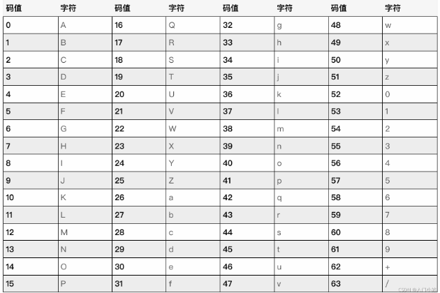
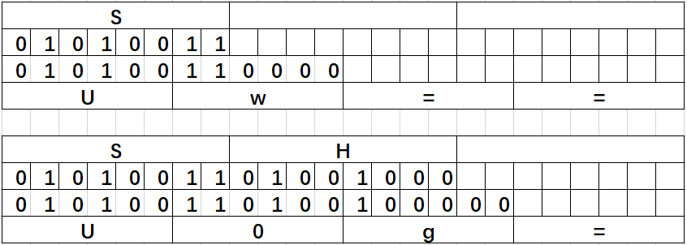

# base64

base64 implemented in C language


## 1. base64原理


### 1.1编码
1. 分组
将原本的数据按照3个字符一组进行分组。


2. 重新划分
3*8 == 24 == 4*6
将3个字符的划分成4个6比特的，给这4个6比特的补两位0，补够8比特，这样3个字符就成了4个字符。

3. 编码
重新划分后的字符的整型值一定在0-63之间，一个字符8位，最高两位全是0，所以最大的就是63.
我们那重新划分后的整型值对照编码表进行编码，如果整型值为0，对应的就是A，以此类推。

特殊情况如下图，对于有位数但不够6位的，我们进行补0操作，对于什么也没有的，我们用等号表示



### 1.2 解码
上述过程的逆操作。

## 2.示例代码
见demo.c

## 3.测试代码
见test目录

## 4.注意事项

### 4.1 dst空间大小
若编码前长度n,根据编码规则，编码后的长度m符合这行代码
`m = (n % 3 == 0) ? (n / 3) * 4 : (n / 3 + 1) * 4;`
为了便于打印编码后的数据，强烈建议dst的空间大小应当是m+1;
```
当src_len = 3
必须满足 dst_size >= 4  否则无法存储编码结果
建议满足 dst_size > 4   无可能无法正常打印编码结果
字符串的打印是以'\0'结尾，如果刚刚好够存储，则无法预知下一个存储单元的内容从而造成打印结果与预期不符.
```

### 4.2 src最大长度
你可以使用下面两个宏来查看最大允许的待编码字符长度
```
SUHENG_BASE64_ENCODE_SRC_MAX_LENGTH:encode编码时，允许输入的最大长度。
SUHENG_BASE64_DECODE_SRC_MAX_LENGTH:decode解码时，允许输入的最大长度。
在encode中允许输入的范围是 [0, SUHENG_BASE64_ENCODE_SRC_MAX_LENGTH]，即[0,1610612733]
在decode中允许输入的范围是 [0, SUHENG_BASE64_DECODE_SRC_MAX_LENGTH]，即[0,2147483644]
```


